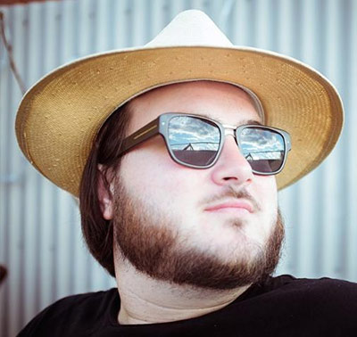

In the past weeks, we read, reviewed and got blown away by more than 120 fantastic talk proposals. We are beyond excited about this year's submissions, and can’t wait to share the final line-up we came up with. Today we’ll start with announcing two more confirmed speakers: [Una Kravets](https://twitter.com/una) and [Glen Maddern](https://twitter.com/glenmaddern)!

## Una Kravets

  

Una is a front-end developer on the IBM Design team in Austin, TX. She blogs, illustrates, is a core member of the Open Design Foundation, and started the DC and Austin Sass Meetups.

## Glen Maddern

  

Glen Maddern is an independent web developer from Melbourne, Australia. He also organizes CSSconf AU, and does rad web stuff.

## Regular Ticket Sale Opens

If you are as excited as we are and don’t want to miss Una and Glen speaking: Tomorrow, August 4, 10am CEST, we‘ll sell our very last tickets. Few are left, so we recommend setting your alarms.
 