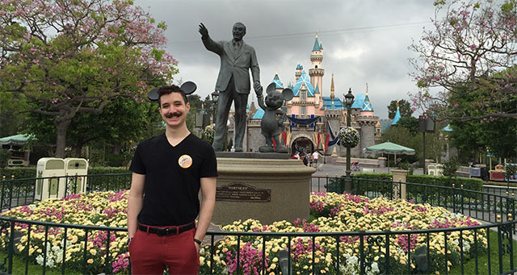

  

## meet Nick Hehr

Nick is an empathetic community member, front-end developer, and avid Disney parks & animation fan. When he’s not at a meetup or contributing to Hoodie, you can probably find him at the nearest climbing gym. His mustache is real and has been growing on him for over two and a half years. 

We are really excited to be welcoming him on stage at CSSconf EU 2015 as this year's MC, and we know you will be, too! We approached Nick to ask him about CSS, how he got into it, what he's working on, and more!

**Hi Nick! Thanks for taking the time to answer some questions for us. Besides being busy with events, what are you working on at the moment?**  
At Namely, I’ve been helping build out a living styleguide and React component library to be used across all of Namely’s products and internal projects. In my spare time, Hoodie has been my main focus for open source contribution. I started with documentation, and have been assisting with the migration to using PouchDB and Hapi plugins. My next big side project will be designing and developing my wedding site as soon as I get back from Berlin. 

**Have you been to Berlin before, and what are you looking forward to the most?**   
This trip to Berlin will be my first time outside of the United States, so I’m incredibly stoked for every part of it, but I’m most excited to meet all the people in the community I’ve gotten to know online over the past few years. 

**Do you remember the first project you wrote CSS for? Is it still online?**  
In college, I studied psychology and business, and one of the required classes was called Computers for Business. In it, I learned about Microsoft Office basics and how to make a website from scratch. Even in 2011, I was taught how to use HTML layout with tables and basic styling with inline CSS (who knew that would make a comeback?) to build a marketing page for a computer store. I was so enthralled by this ability to create something out of seemingly nothing, I started teaching myself web design with all the online resources I could find. That site probably still lives somewhere on that school’s servers. 

  

**If you could teach someone new to CSS one thing, what would that be?**  
I think I would show them CodePen first, for some immediate inspiration on all the awesome things CSS can do. From there, I would probably fork a simple but interesting Pen and let them start poking around the CSS to see how it affects the Pen’s appearance. That confidence in experimenting will be super helpful when building out their own projects in the future.

**What’s the thing you like most about your job?**  
It’s probably the variety of different aspects to the job that I enjoy the most. When I started at Namely, the egineering team was made up almost exclusively of full-stack developers. So, I’ve been able to really help shape the front-end team through improving the interview process, prototyping the initial styleguide, encouraging community outreach, and putting the focus onto things like performance. Even as the team grows, it’s encouraging to know everyone can create positive change through their work.

**If you could make one wish: What would you like to change in our industry?**  
My biggest wish for the industry right now is to encourage empathy everywhere: at work, in open source, at public events like meetups and conferences, and among groups of varying skill and experience. By applying and encouraging empathy, we can learn so much from each other and create a more open, welcoming environment for everyone.

You can follow Nick on [twitter](https://twitter.com/hipsterbrown) and read his musings on his website [hipsterbrown.com](http://hipsterbrown.com/)
